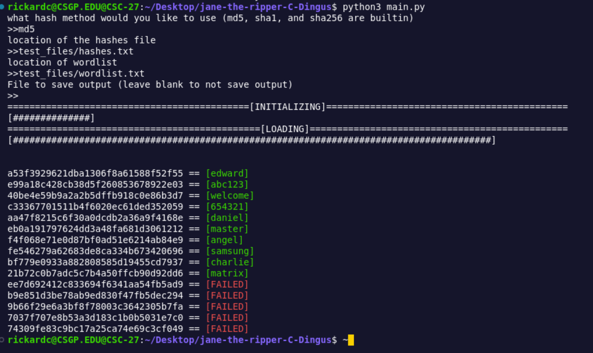

[](https://classroom.github.com/a/d_w3ds2H)
[](https://classroom.github.com/open-in-codespaces?assignment_repo_id=21360705)

# Jane the Ripper

Jane the Ripper is a python script that will attempt to crack the hashes in a hash list you provide, and compare it against all the possible passwords in the wordlist you provide.
The script runs in the terminal and allows you to provide paths to the hash and wordlist files, as well as the hashing algorithm that the hash file used

## Requirements

- Python 3 or higher
- Git

## Installation

1. Clone the Repository
```bash
git clone https://github.com/WTCSC/jane-the-ripper-C-Dingus
```
2. Open the Cloned Repository
```bash
cd jane-the-ripper-C-Dingus
```
## Usage

0. Start the program with the command **`python3 main.py`** in the terminal

1. Enter the hasing method you want to use (md5, sha1, sha2 are builtin)

2. Type in the path to the file with hashes you want to use

3. Type in the path to the wordlist to use

## Usage Example



## Custom Hashes

to add custom hashes append their functions to the mod.py file and run the function name